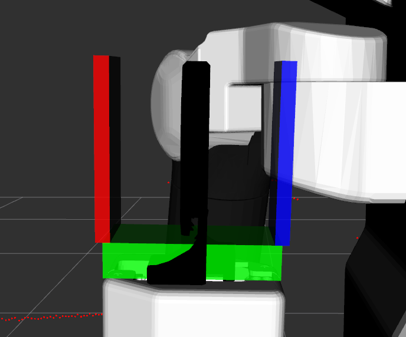
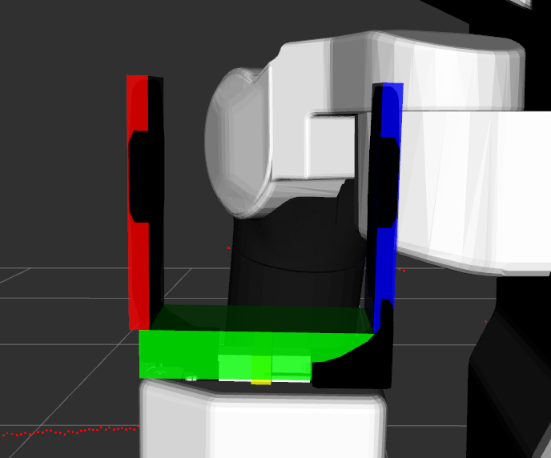

# Simple Grasping Pipeline

This ROS2 package implements a perception and grasp planning pipeline using GPD.  
It processes sensor point clouds to detect planes and objects, and then generates grasp candidates for a selected object.

## StartPerception.srv
This service performs plane and object detection on a point cloud. It is designed for scenarios where objects are assumed to rest on flat, horizontal surfaces like tables or shelves.

### Request

| Field                 | Type                         | Description |
|----------------------|------------------------------|-------------|
| `sensor_msgs/PointCloud2 cloud` | Optional input cloud (used if `header.frame_id` is non-empty). If empty, uses the latest subscribed cloud. |
| `bool only_planes`   | If true, only planes will be detected, skipping object detection. |
| `bool sort_planes_by_height` | If true, planes are sorted from lowest to highest in height. Otherwise, sorted by distance to `querry_point`. |
| `geometry_msgs/Point querry_point` | Reference point for sorting planes/objects by proximity. |
| `float32 height_above_plane` | Height above each detected plane to search for objects. The bounding box is extended upwards by this value. Default: `0.3`. |
| `float32 width_adjustment` | Shrinks or expands the X/Y extent of the plane bounding box before object search. Negative values shrink, positive values expand. |
| `bool return_cloud`  | If true, the inlier clouds of planes and objects are returned. |

### Response

| Field       | Type      | Description |
|-------------|-----------|-------------|
| `bool success` | True if perception ran successfully. |
| `string message` | Info or error message. |
| `Plane[] planes` | Detected horizontal planes (with optional inlier clouds and OBBs). |
| `Object[] objects` | Objects detected above the planes (with supporting plane index and optional cloud). |

### Notes

- The "objects can't fly" assumption means only points *above* a plane within the defined bounding box are considered.
- The query point can help prioritize which planes and objects to process based on proximity.
- Useful for table-top grasping or shelf-based inventory perception.

---
## GenerateGrasps Service

This service generates grasp candidates using GPD for a selected object detected during perception. Grasping is performed by sampling point clouds, optionally augmenting with synthetic plane data, and generating pre-grasp and retreat poses.

### Request

| Field                        | Type                      | Description |
|-----------------------------|---------------------------|-------------|
| `int32 object_index`        | Index of the object to generate grasps for. |
| `bool sample_cloud_from_obb` | If true, sample cloud points from object OBBs instead of the sensor cloud. |
| `bool disable_top_grasp`    | If true, adds a synthetic ceiling (duplicate plane cloud above) to block top-down grasps. |
| `float32 min_distance_to_plane` | Vertical offset to apply when augmenting with synthetic plane cloud. |
| `int32 num_grasps_selected` | Number of top scoring grasp candidates to return. |
| `geometry_msgs/Point approach_direction` | Desired grasp approach direction (default: `(1, 0, 0)`). |
| `float32 thresh_deg`        | Angular threshold (in degrees) for filtering grasps by approach direction. Set to 0 to disable filtering. |
| `float32 pre_grasp_dist`    | Offset distance along the approach vector for pre-grasp pose. |
| `float32 retreat_dist`      | Offset distance along the plane normal for retreat pose. |

### Response

| Field         | Type         | Description |
|---------------|--------------|-------------|
| `bool success` | True if grasp generation was successful. |
| `string message` | Status or error message. |
| `Grasp[] grasps` | List of grasp candidates. Each `Grasp` includes:  • `PoseStamped pre_grasp`  • `PoseStamped grasp`  • `PoseStamped retreat`  • `float64 score`  • `bool is_full_antipodal`  • `bool is_half_antipodal`  • `float64 grasp_width` |

### Notes

- When `sample_cloud_from_obb` is true, the grasp candidates are generated from geometric box surfaces rather than real sensor points.
- Setting `disable_top_grasp` is useful for blocking top grasps in cluttered environments or when ceiling constraints exist (like in a shelf).
- The approach direction and `thresh_deg` let you limit grasps to those coming from a desired direction (e.g., front or side grasps).
- Pre-grasp and retreat poses can be used for planning motion to and from the grasp location.

## Hand Marker
A marker of the hand is published at `~/hand` using the `grasping_frame_id` parameter. This is usefull to compare the dimenstions of the hand compared to the urdf model of your robot.

