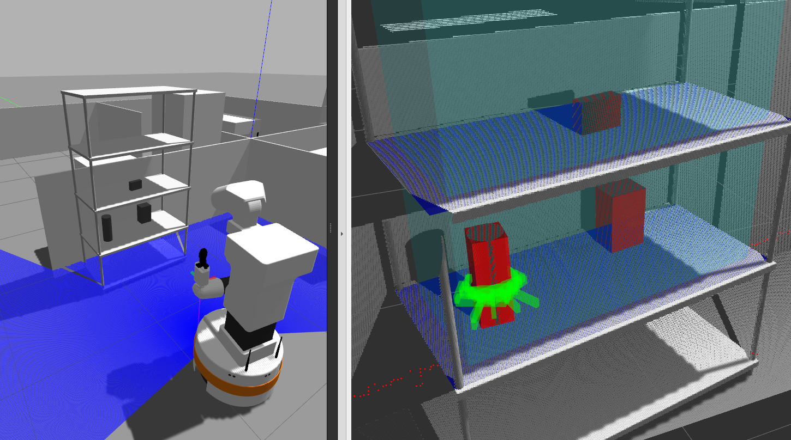

# Simple Grasping Pipeline

This ROS2 package implements a perception and grasp planning pipeline using GPD.  
It processes sensor point clouds to detect planes and objects, and then generates grasp candidates for a selected object.

## Services

### StartPerception.srv
**Purpose:**  
Processes the latest input point cloud to perform perception tasks. Specifically, this service:
- Transforms the input cloud to a common reference frame.
- Filters the cloud based on configurable parameters.
- Detects horizontal planes (e.g., tables) using normals and clustering.
- Sorts the detected planes either by height or by distance to a user-specified query point.
- Detects objects (clusters) above the planes using adjustable height and width parameters.
- Publishes debug markers (if enabled) for visualization.

**Request Options:**
- `bool return_cloud`  
  If true, the service returns the raw inlier cloud for each detected plane and object.
- `bool sort_planes_by_height`  
  If true, planes are sorted by the z-coordinate of their centers; otherwise, they are sorted by distance to `querry_point`.
- `geometry_msgs/Point querry_point`  
  A reference point used to sort planes and objects when not sorting by height.
- `float32 height_above_plane`  
  The maximum height above a plane at which objects are detected (default ~0.3 m if not provided).
- `float32 width_adjustment`  
  A parameter to expand/shrink the region of interest for object detection.

**Response:**
- `bool success` – True if perception succeeded.
- `string message` – Additional status information.
- `Plane[] planes` – Array of detected planes. Each plane includes:
  - An oriented bounding box (visualized as a marker in blue).
  - (Optionally) its inlier cloud and plane equation coefficients.
- `Object[] objects` – Array of detected objects. Each object includes:
  - An oriented bounding box marker (red).
  - The index of the supporting plane.
  - (Optionally) its segmented cloud.

---

### GenerateGrasps.srv
**Purpose:**  
Generates grasp candidates for a selected object using GPD. This service performs the following steps:
- **Cloud Sampling:**  
  Combines point cloud data from all objects on the same plane as the selected object.  
  It supports two sampling modes:
  - **Sensor Cloud Mode:** Uses the original perception cloud.
  - **OBB Sampling Mode:** Samples the point cloud directly from each object’s oriented bounding box (OBB), so that GPD will try to grasp the bounding box.
- **Synthetic Plane Augmentation:**  
  Optionally augments the combined cloud with synthetic plane points to simulate environmental constraints (e.g., a ceiling).  
  The plane cloud can be offset vertically by `min_distance_to_plane` and further duplicated if `disable_top_grasp` is true.
- **Coordinate Transformation:**  
  Transforms the combined cloud and the sensor origin into the object coordinate frame.
- **Grasp Generation and Filtering:**  
  Sets the grasp detector’s approach direction and angular threshold for filtering candidates.  
  The approach direction is taken from the service request (defaulting to (1, 0, 0) if not provided).
- **Pre-grasp and Retreat Poses:**  
  For each grasp candidate, computes:
  - A **pre_grasp** pose by offsetting the grasp pose along the approach direction by `pre_grasp_dist`.
  - A **retreat** pose by offsetting the grasp pose along the supporting plane’s normal by `retreat_dist`.
- **Candidate Selection:**  
  Generates a list of grasp candidates, selects the top candidates by score (as specified by `num_grasps_selected`), and returns the complete grasp information.

**Request Options:**
- `int32 object_index`  
  Index of the object to grasp.
- `bool sample_cloud_from_obb`  
  If true, samples the point cloud from each object's OBB instead of using the sensor cloud.
- `bool disable_top_grasp`  
  If true, adds an additional upward copy of the plane cloud so that GPD “sees” a ceiling.
- `float32 min_distance_to_plane`  
  The minimum distance the gripper should maintain from the plane.  
  This value vertically offsets the plane cloud.
- `int32 num_grasps_selected`  
  The number of top grasp candidates (sorted by score) to return.
- `geometry_msgs/Point approach_direction`  
  The desired approach direction for the grasp candidates (default is (1, 0, 0) if not provided).
- `float32 thresh_rad`  
  The angular threshold (in radians) for filtering grasp candidates based on their approach direction.  
  A value of 0 disables filtering.
- `float32 pre_grasp_dist`  
  The distance along the approach direction from the grasp pose to compute the pre-grasp pose.
- `float32 retreat_dist`  
  The distance along the plane’s normal from the grasp pose to compute the retreat pose.

**Response:**
- `bool success` – True if grasp generation succeeded.
- `string message` – Additional status information.
- `Grasp[] grasps` – An array of grasp candidates. Each `Grasp` message includes:
  - `geometry_msgs/PoseStamped pre_grasp` – The pre-grasp pose.
  - `geometry_msgs/PoseStamped grasp` – The actual grasp pose.
  - `geometry_msgs/PoseStamped retreat` – The retreat pose.
  - `float64 score` – The quality score of the grasp candidate.
  - `bool is_full_antipodal`- Whether the grasp is antipodal.
  - `bool is_half_antipodal`- Whether the grasp is indeterminate.
  - `float64 grasp_width`- Width of the object contained in the grasp
